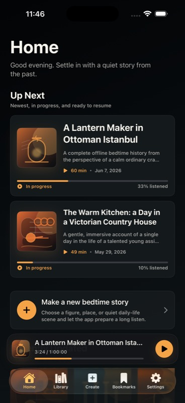
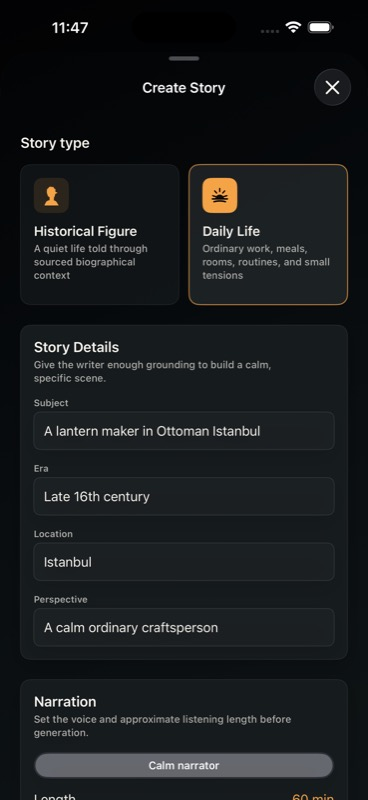
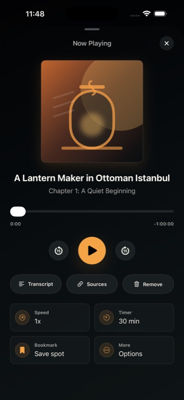
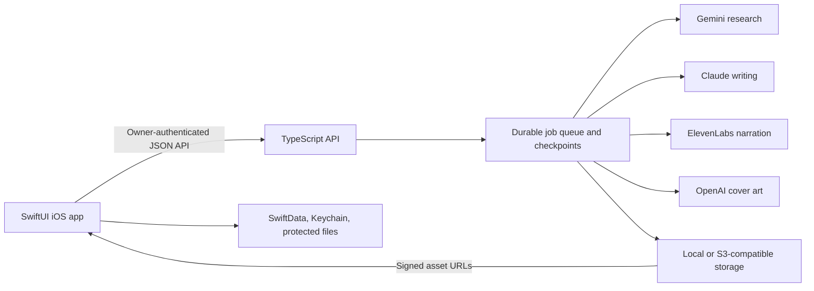

# Sleepy History

Sleepy History is a native iOS bedtime audio app that turns a historical subject into an original, long-form story designed for calm listening. A user can choose a historical figure or an ordinary daily-life setting, guide the perspective and era, generate a sourced story package, and listen with the screen off.

The project is a full-stack, personal-first mobile app. The SwiftUI client handles discovery, creation, library management, downloads, and background playback. A TypeScript backend protects paid provider credentials, coordinates a durable multi-stage generation pipeline, and returns the finished audio, cover art, transcript, chapters, and sources as one story.

## Screenshots

<table>
  <tr>
    <td align="center"><br><strong>Home</strong></td>
    <td align="center"><br><strong>Create Story</strong></td>
    <td align="center"><br><strong>Now Playing</strong></td>
  </tr>
</table>

The screenshots use the app's deterministic mock mode. They contain representative local stories and require no provider credentials.

## Why this app exists

Most history products are built for active reading, short videos, or high-energy storytelling. Sleepy History explores a different product shape: historically grounded audio with a quiet pace, low visual friction, and controls that remain useful when the listener is tired.

The design goals are:

- Make a long bedtime listen from a simple historical idea.
- Keep the result original, source-aware, and explicit about uncertainty.
- Make generation progress understandable without exposing provider complexity.
- Preserve listening progress, bookmarks, and downloads across launches.
- Continue audio reliably while the iPhone is locked.
- Keep paid AI credentials and budget controls off the device.

Sleepy History is inspired by the broader pattern of long-form history for sleep. It does not copy another show's scripts, branding, episode titles, voice identity, or presentation.

## The user flow

1. **Discover or resume**
   Home surfaces in-progress stories, recent additions, starter ideas, and a persistent mini player.

2. **Shape a story**
   Create Story lets the user choose Historical Figure or Daily Life, then provide a subject, era, location, perspective, narrator, and target duration.

3. **Review the generation estimate**
   The app presents the approximate cost and processing time, along with an AI provider disclosure, before a real request is submitted.

4. **Generate through the protected backend**
   An enrolled device sends an authenticated request. The app follows the job through research, outlining, writing, review, narration, cover creation, and final assembly. Jobs can be canceled, retried, or resumed after an interruption.

5. **Import the completed story**
   The result is saved into the local SwiftData library with its metadata, chapters, source records, transcript, cover art, audio locations, download state, and playback position.

6. **Listen and manage**
   Library supports search and status filters. The player includes 15-second skipping, playback speed, sleep timer, bookmarks, transcript, sources, downloads, and system lock-screen controls.

## Product features

### Listening experience

- Dark, low-glare SwiftUI interface designed for one-handed nighttime use
- Home, Create, Library, Bookmarks, and Settings tabs
- Full player plus a persistent mini player
- Background audio and lock-screen playback controls
- Persistent position, duration, chapter, last-played state, and playback bookmarks
- Adjustable speed, sleep timer, seek slider, and 15-second skip controls
- Streaming audio cached to disk before long background playback
- File protection that keeps downloaded audio available after the first device unlock

### Story generation

- Historical Figure and Daily Life request presets
- User-controlled era, location, perspective, narrator, and duration
- Grounded research dossier with claims, source mappings, chronology, and uncertainty notes
- Chaptered script with continuity checkpoints and duration targets
- Bedtime-tone, safety, originality, and source-map validation
- Long-form text-to-speech chunking with idempotency keys
- Generated cover art with story-specific prompt constraints and text-free output rules
- Durable stage checkpoints, retry limits, and stale-worker recovery

### Library and ownership

- SwiftData-backed local library
- Search and All, Downloaded, In Progress, and Completed filters
- Story details with overview, transcript, sources, and notes sections
- Download management, listening history, story bookmarks, and playback bookmarks
- One-time device enrollment with the resulting owner token stored in Keychain
- Provider status and operational settings kept out of the primary listening flow

## Architecture



### iOS client

| Area | Implementation |
| --- | --- |
| UI | Swift 6 and SwiftUI, with native navigation, sheets, tab structure, Dynamic Type support, and VoiceOver labels |
| Persistence | SwiftData models for stories, assets, chapters, sources, playback state, downloads, and bookmarks |
| Playback | AVFoundation and AVPlayer with background audio, interruptions, remote commands, Now Playing metadata, speed, seeking, and sleep timers |
| Networking | URLSession client with typed request, job, story, asset, and error models |
| Security | Security framework Keychain storage for the enrolled device token; no provider API keys in the app |
| Offline behavior | Streamed downloads are written to protected local files; mock mode produces local fixtures for UI and playback testing |

### Backend and worker

| Area | Implementation |
| --- | --- |
| Runtime | Node.js 22 and TypeScript 5.9, using the built-in HTTP server |
| Contracts | Typed schemas for generation requests, jobs, stories, chapters, sources, assets, and API errors |
| Jobs | File-backed job store and durable queue with stage and audio-chunk checkpoints |
| Providers | Interface-driven research, writing, voice, image, and storage adapters with mock implementations for tests |
| Storage | Local signed URLs for development or AWS Signature V4 compatible object storage such as Cloudflare R2 |
| Reliability | Idempotency keys, bounded retries, resumable job stages, stale running-job leases, streamed audio assembly, and typed provider quota failures |
| Operations | Health endpoint, provider status details, budget caps, audit-friendly job metadata, and an emergency provider kill switch |

### Default provider registry

Provider model IDs remain configurable because provider naming and availability can change.

| Pipeline role | Adapter | Current default |
| --- | --- | --- |
| Research | Google Gemini with grounding metadata | `gemini-3.1-pro-preview` |
| Script writing | Anthropic Claude | `claude-opus-4-6` |
| Narration | ElevenLabs | `eleven_multilingual_v2`, 24 kHz PCM |
| Cover art | OpenAI Images | `gpt-image-2` |
| Generated assets | Local signed storage or S3-compatible storage | Local development storage, with Cloudflare R2 compatible production support |

### Generation lifecycle

The worker advances a job through explicit states:

```text
queued
  -> researching
  -> outlining
  -> writing
  -> reviewing
  -> voicing
  -> imaging
  -> assembling
  -> completed
```

Failed and canceled jobs retain enough state for safe diagnostics or a bounded retry. The iOS client polls active jobs, treats temporary connection loss as a reconnecting state, and imports a completed story only after its final metadata is available.

## API surface

The server exposes a small JSON API:

| Method | Route | Purpose |
| --- | --- | --- |
| `GET` | `/health` | Backend, worker, storage, and provider status |
| `POST` | `/enrollment-codes` | Create a short-lived owner enrollment code through local or admin access |
| `POST` | `/device-enrollments` | Exchange a single-use code for a random device token |
| `POST` | `/generation-jobs` | Validate, budget-check, and queue a story request |
| `GET` | `/generation-jobs/:id` | Read job state and progress |
| `POST` | `/generation-jobs/:id/cancel` | Cancel an active job |
| `POST` | `/generation-jobs/:id/retry` | Retry an eligible failed or canceled job |
| `DELETE` | `/generation-jobs/:id` | Delete a job and associated generated assets |
| `GET` | `/stories/:id` | Fetch a completed story with refreshed asset URLs |

Generation and completed-story routes require an enrolled owner device. Health and the bundled demo story are public, while enrollment code creation requires loopback or admin authorization.

## Security and cost boundaries

This project calls paid providers, so operational safety is part of the architecture rather than an afterthought.

- Provider credentials exist only in the backend environment.
- The iOS release validator rejects provider key names, likely static bearer tokens, and broad ATS exceptions in app sources.
- Owner access uses a one-time enrollment code and a random device token. The app stores the token in Keychain, while the backend works with HMAC-derived token hashes.
- Maximum story length, per-job cost, daily cost, retry cost, paid retry count, and provider attempt count are enforced on the server.
- A provider kill switch can stop new paid work immediately.
- Content review rejects disallowed prompts and records safety and originality findings in job metadata.
- The safe source-fetching utility restricts requests to HTTPS destinations and applies private-network, redirect, size, and timeout protections.
- Generated assets use expiring signed URLs, while downloaded files stay local to the app.

Do not commit a populated `.env`, provider keys, enrollment tokens, signing secrets, storage credentials, generated audio, or real job data. The repository ignore rules cover these paths, but secret management still belongs in the deployment platform.

## Repository layout

```text
.
├── ios/                       SwiftUI app, tests, XcodeGen spec, and Xcode project
├── server/                    TypeScript API, worker, provider adapters, and tests
├── docs/                      Product, security, deployment, provider, and runbook notes
├── docs/screenshots/          README screenshots captured from deterministic mock mode
├── scripts/                   Full validation and iOS release-boundary checks
├── Plans.md                   Detailed implementation history and verification evidence
├── PRODUCT.md                 Product principles and audience
├── DESIGN.md                  Visual system and interaction direction
├── .env.example               Safe backend configuration template
└── railway.json               Railway deployment configuration
```

## Running locally

### Prerequisites

- macOS with Xcode 26 and an iOS 26 simulator runtime
- XcodeGen available on `PATH`
- Node.js 22 or newer
- Provider accounts and object storage only if you intend to run the paid production pipeline

### 1. Configure and start the backend

```bash
cp .env.example .env
npm --prefix server ci
npm --prefix server run build
npm --prefix server start
```

The development server starts on `127.0.0.1:8787` by default. With providers disabled, `/health`, contract behavior, enrollment plumbing, and the in-memory job API can be exercised without paid calls. A real production run requires explicit provider flags, credentials, storage configuration, owner enrollment secrets, and budget caps.

### 2. Configure the app API URL

`SleepyHistoryAPIBaseURL` is defined in `ios/project.yml`. Point it at your own backend before regenerating the Xcode project. The value currently checked into the project represents the owner's protected deployment and does not grant generation access to another device.

For an iOS simulator using the local backend:

```yaml
SleepyHistoryAPIBaseURL: http://127.0.0.1:8787
```

### 3. Generate and open the Xcode project

```bash
xcodegen generate --spec ios/project.yml --project ios
open ios/SleepyHistory.xcodeproj
```

Select the `SleepyHistory` scheme and an iPhone simulator. For the deterministic showcase mode, add these launch arguments to the Run action in the scheme:

```text
--reset-ui-testing-state
--use-mock-generation
```

Mock mode is intended for screenshots, UI tests, and product exploration. It bypasses paid generation and builds local story fixtures.

Simulator builds do not require code signing. To install on a physical iPhone, select your own Apple Developer team in the target's Signing & Capabilities settings.

### 4. Enroll a device for real generation

When the backend is configured with `DEVICE_TOKEN_HMAC_SECRET`, create a short-lived code through local or admin-authorized access, then enter that code in the app's Settings > Enrollment screen. The app exchanges it once and keeps the returned device token in Keychain.

See `docs/device-runbook.md`, `docs/runbook.md`, and `docs/security-budget-controls.md` for the detailed operational flow.

## Validation

Run the complete local check when XcodeGen, the iOS runtime, and Node.js are installed:

```bash
bash scripts/full-validation.sh
```

Or run the layers separately:

```bash
# iOS build
xcodebuild \
  -project ios/SleepyHistory.xcodeproj \
  -scheme SleepyHistory \
  -destination 'generic/platform=iOS Simulator' \
  build

# iOS unit and UI tests
xcodebuild \
  -project ios/SleepyHistory.xcodeproj \
  -scheme SleepyHistory \
  -destination 'platform=iOS Simulator,name=iPhone 17 Pro Max' \
  test

# Backend checks
npm --prefix server run build
npm --prefix server test
npm --prefix server run lint

# iOS secret and network boundary check
node scripts/validate-release.mjs
```

The test suites cover persistence, enrollment, API mapping, downloads, playback, generation requests, queue recovery, provider parsing, content review, source validation, audio assembly, storage signing, budget controls, health reporting, and production runtime behavior. Real-provider smoke tests are present but skip safely unless their credentials are supplied.

## Deployment notes

The checked-in `railway.json` runs the compiled Node server in production. Production mode creates the hosted runtime, starts the background worker, persists queue and job state, and expects all enabled provider and storage secrets from the deployment environment.

The iOS target is currently configured for an iPhone-first deployment on iOS 26. Direct Xcode installation has been the primary distribution path during development. TestFlight and App Store preparation notes live in `docs/testflight-app-store-checklist.md` and `docs/app-review-notes.md`.

## Project status

Sleepy History is a working, portfolio-ready personal MVP rather than a public multi-user service. The native app, mock experience, owner enrollment, generation orchestration, generated-story import, local persistence, protected downloads, and background playback are implemented and tested.

Current product boundaries:

- iPhone only, targeting iOS 26
- One owner and enrolled devices, not a general account system
- No social feed, public story marketplace, or creator platform
- Paid generation requires the operator's own provider accounts and deployment
- Provider model IDs and pricing assumptions must be reviewed before a new production deployment

## License

Sleepy History is available under the [MIT License](LICENSE).
